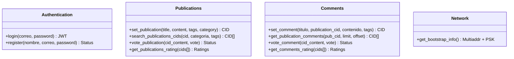

# 🚀 FODES API Documentation

This document describes the functions, parameters, and data structures for the **FODES** decentralized content API.

---

## 📊 API Architecture Overview

---

## 🔐 1. Authentication
Handles user access and identity.

### **Register User**
*   **Endpoint:** `POST /register`
*   **Description:** Creates a new account.
*   **Parameters (JSON):**
    *   `nombre` (string): Full name.
    *   `correo` (string): Unique email.
    *   `password` (string): Plain text (will be hashed).

### **Login**
*   **Endpoint:** `POST /login`
*   **Description:** Authenticates and returns a Bearer Token.
*   **Parameters (JSON):**
    *   `correo` (string): Registered email.
    *   `password` (string): Password.
*   **Output:** `{ "access_token": "...", "token_type": "bearer" }`

---

## 📝 2. Publications
Main content management system.

### **Create Publication**
*   **Endpoint:** `POST /publications`
*   **Auth:** Required (Bearer Token).
*   **Parameters (JSON):**
    *   `title` (string): Title of the post.
    *   `content` (string): Markdown or text body.
    *   `tags` (string[]): Array of tag names (e.g., `["news", "tech"]`).
    *   `category` (string): Must match an existing category in the DB.
*   **Returns:** A unique **CID** (Content Identifier) generated from the payload.

### **Search Publications**
*   **Endpoint:** `GET /publications/search-cids`
*   **Query Parameters:**
    *   `cid` (string): Optional. Search by specific CID.
    *   `categoria` (string): Optional. Filter by category name.
    *   `tags` (string[]): Optional. Filter by tags.

---

## 💬 3. Comments
Linked to publications via CIDs.

### **Create Comment**
*   **Endpoint:** `POST /comments`
*   **Parameters (JSON):**
    *   `titulo` (string): Comment subject.
    *   `publication_cid` (string): **CID of the parent post**.
    *   `contenido` (string): Body text.
    *   `tags` (int[]): Optional. List of numeric tag IDs.

### **List Comments**
*   **Endpoint:** `GET /comments/publication/{publication_cid}`
*   **Parameters:** `limit` (int), `offset` (int).

---

## ⭐ 4. Voting & Ratings
Shared logic for both Publications and Comments.

| Method | Endpoint | Description | Constraints |
| :--- | :--- | :--- | :--- |
| **POST** | `/publications/vote` | Rate a post. | `vote` must be **0 to 5**. |
| **POST** | `/comments/vote` | Rate a comment. | `vote` must be **0 to 5**. |
| **POST** | `/*/rating` | Batch ratings. | Input: `{"cids": ["cid1", "cid2"]}` |

---

## 🌐 5. Network (P2P Connectivity)
Essential for node discovery.

### **Bootstrap Info**
*   **Endpoint:** `GET /network/bootstrap-info`
*   **Returns:**
    *   `bootstrap_node`: The Multiaddr (IP/Port/ID) of the entry node.
    *   `psk`: Pre-Shared Key for the private swarm.

---

## 🛠️ Data Types & Interfaces

| Name | Type | Description |
| :--- | :--- | :--- |
| `CID` | `string` | Unique content hash (e.g., `bafy...`). |
| `vote` | `integer` | Points between 0 and 5. |
| `timestamp` | `ISO8601` | Date format: `YYYY-MM-DDTHH:MM:SS`. |
| `tags (Pubs)` | `List[str]` | String names. |
| `tags (Comments)`| `List[int]` | Numeric IDs. |

---

## 🚦 Rate Limits
*   **Register/Login:** 5 requests / minute.
*   **Create Publication:** 3 requests / minute.
*   **Voting:** 10 requests / minute.
*   **Ratings (Batch):** 20 requests / minute.
